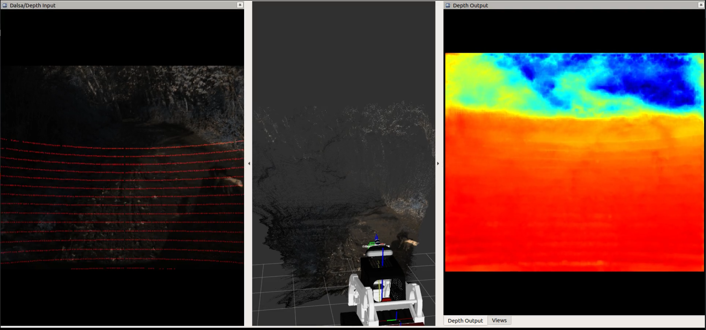

# MSH-CHN ROS
### Version 1.0 (M. Eduarda Andrada)

## Overview
This packages includes nodes regarding depth completion. It uses MSG-CHN as the neural network based on the paper "[A Multi-Scale Guided Cascade Hourglass Network for Depth Completion](http://openaccess.thecvf.com/content_WACV_2020/papers/Li_A_Multi-Scale_Guided_Cascade_Hourglass_Network_for_Depth_Completion_WACV_2020_paper.pdf)" by Ang Li, Zejian Yuan, Yonggen Ling, Wanchao Chi, Shenghao Zhang，and Chong Zhang.

<p align="center">
  
</p>

## Installation
### Dependencies
- Python 3.6
- Pytorch 1.10.0
- [Robot Operating System (ROS)](http://wiki.ros.org)
- CV_bridge for python 3 -- Follow these (**instructions**)[https://cyaninfinite.com/ros-cv-bridge-with-python-3/] 
    **Note:** The commmand:
     ```catkin config -DPYTHON_EXECUTABLE=/usr/bin/python3 -DPYTHON_INCLUDE_DIR=/usr/include/python3.6m -DPYTHON_LIBRARY=/usr/lib/aarch64-linux-gnu/libpython3.6m.so``` is set for python3.6 and archlinux. for x86_64 change to:
     ```
     catkin config -DPYTHON_EXECUTABLE=/usr/bin/python3 -DPYTHON_INCLUDE_DIR=/usr/include/python3.6m -DPYTHON_LIBRARY=/usr/lib/x86_64-linux-gnu/libpython3.6m.so
     ```
     **Note 2**: Only add ``` source install/setup.bash --extend``` to bashrc if it will **not** affect other packages. If there is compatibility issue, only source in the terminal where you will run
     the msg launch file. 

#### Python Dependencies
```
cd path/to/msg_chn_ros/
python3 -m pip install -r requirements.txt
```

#### ROS Dependencies
These can be installed by using the following command:
```
cd your_catkin_workspace
rosdep install --from-paths src --ignore-src -r -y
```

## Compiling

```
cd your_workspace 
catkin_make 
```

## Example Usage
### Launch files
To launch the original and colored depth completed images:
```
# No Arguments
roslaunch msg_chn_ros msg_chn.launch
# Example with arguments
roslaunch msg_chn_ros msg_chn.launch colored_pcl:=true simulation:=false
```

**Arguments**

`colored_pcl` (`bool`, `default: false`)

If `true`, it creates a colored point cloud using depth_completion image in the topic `/dalsa_lidar/pcl`

`simulation` (`bool`, `default:false`)

If `true` it uses sim time and republishes from dalsa 720p compressed to raw and it publishes camera info from dalsa because original rosbag from 2019 did not include camera info. Only use simulation if you have access to dalsa_genie_nano_c2420 and the semfire rosbags. 

`rviz` (`bool`, `default:false`)

If `true`, it uses the custom rviz inside the package which includes SEMFIRE Ranger model, which displays overlaid depth/dalsa and depth completion output



### MSG-CHN

This node created a dense depth map from the original LiDAR PCL and RGB Image. Parameters available in the yaml config file

**Parameters**

`camera_topic` (`string`, `default: dalsa_camera_720p`)

Camera Topic to create depth map from that perspective

`depth_topic` (`string`, `default: /front_lslidar/depth/image_raw`)

Depth input for depth completion.

`path_model` (`string`, `default: $(find msg_chn_ros)/msg_chn/model/final_model.pth.tar`)

Neural network model path. 

`network_path` (`string`, `default: $(find msg_chn_ros)/msg_chn/workspace/exp_msg_chn`)

The neural network architecture path. 

`abs_path` (`string`, `default: $(find msg_chn_ros)`)

Absolute path for the original msg files

`norm_value` (`float`, `default: 30.`)

Normalization value for visualization purposes. It will normalize all images from meters to 0-255 image before coloring.

**Subscribed Topics**

**`camera_topic`** ([sensor_msgs/Image])

Camera used for projections. Defaults at `dalsa_camera_720p`

**`depth_topic`** ([sensor_msgs/Image])

Depth image topic. Needs to be a depth image (float16 or 32). Defaults at `front_lslidar/depth/image_raw`


**Published Topics**

**`/depth_completion/image_raw`** ([sensor_msgs/Image])

Creates dense depth image. Raw and Compressed

**Node**

```
rosrun msg_chn_ros msg_chn_node.py
```

### MSG-CHN Colored
This node outputs colored images using inverted colormap JET (Blue furthest, Red closest). 

`depth_map_colored/camera_topic` (`string`, `default: dalsa_camera_720p`)

Subscribes to camera topic to overlay depth points over it.

**Subscribed Topics**

**`camera_topic`** ([sensor_msgs/Image])

Camera used for overlaid colored images. Defaults at `dalsa_camera_720p`

**`depth_topic`** ([sensor_msgs/Image])

Depth image topic to create colored image. Defaults at `front_lslidar/depth/image_raw`

**Published Topics**

**`/depth_completion/colored/image_raw`** ([sensor_msgs/Image])

Creates colored image. Raw and Compressed

**`/depth_copmletion/overlaid/colored/image_raw`** ([sensor_msgs/Image])

Overlays colored depth into the camera image. Raw and Compressed

**Node**
```
rosrun msg_chn_ros msg_chn_colored.py

```